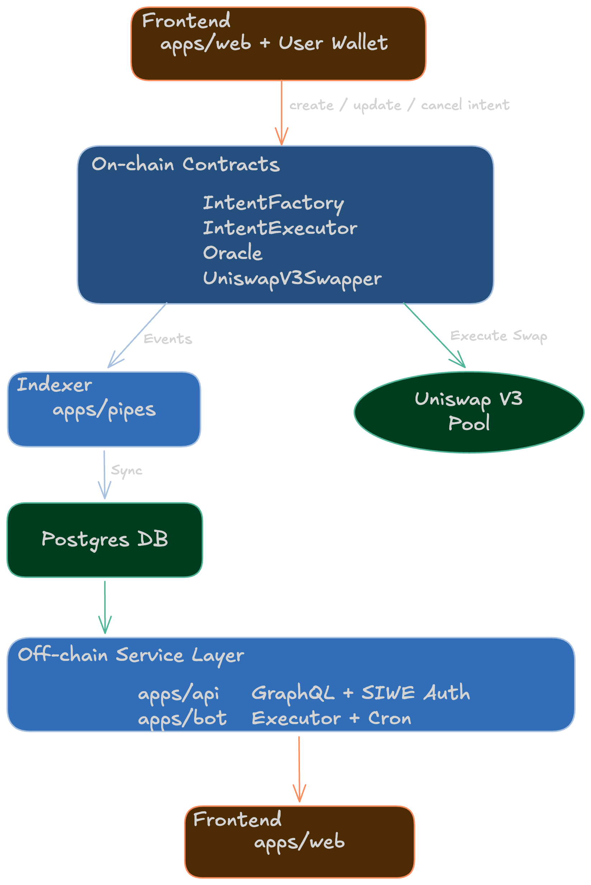

# IntentSwap

An **on-chain conditional intent swap protocol**.

Users create swap intents with a price threshold and expiry, and a **permissionless executor** can execute them when conditions are met — earning an on-chain reward.

## 🧠 Overview

IntentSwap allows users to:

- Create swap intents with custom **price thresholds**
- Set **expiration times** for intents
- Enable **permissionless execution**
  - Anyone can execute intents and earn rewards
  - A default bot (`apps/bot`) is provided for liveness
- Use **Chainlink oracles** for reliable pricing
- Execute swaps via **Uniswap V3** with slippage protection

## 🏗 Architecture



> High-level system architecture showing on-chain contracts, indexing pipeline, and off-chain execution.

## 🔄 Execution Flow

### 1. User creates an intent

- Via frontend (`apps/web`)
- Calls `IntentFactory.createIntent()`
- Specifies:
  - token pair
  - amount
  - price threshold
  - expiration
- User grants ERC20 allowance to `IntentExecutor`.

### 2. Events are indexed

- `apps/pipes` (SQD Pipes indexer)
- Consumes on-chain events:
  - `IntentCreated`
  - `IntentUpdated`
  - `IntentExecuted`
  - `IntentCancelled`
- Stores state in **Postgres**

### 3. API serves data

- `apps/api` (Hono + GraphQL)
- Provides:
  - intent queries
  - event history
  - SIWE authentication

### 4. Executors monitor and execute

- `apps/bot` runs a scheduled job
- Checks whether intents are **fillable**
- Calls `IntentExecutor.executeIntent(intentId)`

### 5. Swap is executed on-chain
- `IntentExecutor` validates:
  - price condition
  - expiration
- Calls `UniswapV3Swapper`
- Executes swap on **Uniswap V3**
- Distributes:
  - protocol fee
  - executor reward

## 🧱 Monorepo Structure

```text
intentswap/
├── apps/
│   ├── web/        # Next.js frontend (UI + wallet)
│   ├── api/        # GraphQL + auth (Cloudflare Worker)
│   ├── bot/        # Executor bot (cron + KV)
│   └── pipes/      # SQD Pipes indexer → Postgres
├── packages/
│   ├── hardhat/                # Smart contracts + deploy scripts
│   ├── contract-deployments/   # Generated ABIs + addresses
│   ├── db/                     # Drizzle schema + DB client
│   ├── auth/                   # Shared auth utilities
│   └── graphql-artifacts/      # Persisted GraphQL queries
```

## 📦 Smart Contracts

| Contract | Description |
|----------|-------------|
| `IntentFactory` | Creates and manages intents |
| `IntentExecutor` | Validates + executes intents |
| `Oracle` | Chainlink price feed registry |
| `UniswapV3Swapper` | Swap execution layer |

## ⚙️ Tech Stack

**Smart Contracts**
- Solidity
- Hardhat
- OpenZeppelin
- Chainlink Price Feeds
- Uniswap V3

**Frontend**
- Next.js 16 + React 19
- Tailwind CSS + shadcn/ui
- Wagmi / Viem
- RainbowKit
- TanStack Query
- Urql + gql.tada

**Backend / Infra**
- Cloudflare Workers
- Hono + GraphQL Yoga + Pothos
- Better Auth (SIWE)
- Drizzle ORM + PostgreSQL
- SQD Pipes (Subsquid)

## 🚀 Getting Started

### Prerequisites

- Node.js 20+
- pnpm 8+
- PostgreSQL
- Sepolia ETH (for testing)

### Installation

```bash
# Clone the repository
git clone https://github.com/yzy98/intentswap.git
cd intentswap

# Install dependencies
pnpm install
```

### Environment Setup

**apps/pipes/.env**
```env
DATABASE_URL=postgres://...
PORTAL_URL=https://portal.sqd.dev/datasets/ethereum-sepolia
CHAIN_ID=11155111
```

**apps/api/.dev.vars**
```env
BETTER_AUTH_SECRET=your_secret
RPC_URL=https://...
```

**apps/bot/.dev.vars**
```env
RPC_URL=https://...
PRIVATE_KEY=0x...
```

**apps/web/.env.local**
```env
NEXT_PUBLIC_PROJECT_ID=your_walletconnect_project_id
NEXT_PUBLIC_CHAIN_ID=11155111
NEXT_PUBLIC_BOT_API_URL=http://localhost:8787
NEXT_PUBLIC_API_BASE_URL=http://localhost:4000

# Public chain values used by UI
NEXT_PUBLIC_WRAPPED_ETH_TOKEN_ADDRESS=0x...
NEXT_PUBLIC_LINK_TOKEN_ADDRESS=0x...
NEXT_PUBLIC_PRICE_FEED_CONTRACT_LINK_TO_ETH_ADDRESS=0x...
```

### Deploy Contracts

```bash
# Build contracts
pnpm --filter @packages/hardhat build

# Deploy to Ethereum Sepolia
pnpm --filter @packages/hardhat deploy:sepolia

# Or deploy to localhost
pnpm --filter @packages/hardhat node
pnpm --filter @packages/hardhat deploy:localhost
```

After deployment, the script updates:

- `packages/contract-deployments/src/generated/abis/*.ts`
- `packages/contract-deployments/src/generated/deployments.ts`
- `packages/contract-deployments/src/generated/deployments.json`

### Run Dev

```bash
# Run everything together (api + pipes + bot + web)
pnpm dev:all

# Or run individually
pnpm dev:api
pnpm dev:pipes
pnpm dev:bot
pnpm dev:web
```

## 🔐 Security Notes

- **Permissionless execution**
  - anyone can execute intents
  - incentivized via `executorRewardBps`
- **Access control**
  - `UniswapV3Swapper` only callable by authorized executor
- **Safety**
  - `Pausable`
  - `ReentrancyGuard`

## 🌐 Network

| Network | Chain ID | Status |
|---------|----------|--------|
| Sepolia | 11155111 | Active |

## 📜 License

MIT
